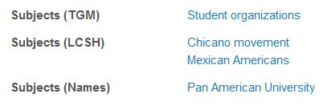

**Dublin Core Metadata Terms**[1](#f1)

For the digital collections and institutional repository at UTRGV, most of the elements and some qualifiers in Dublin Core are employed. Additionally, encoding schemes such as the Library of Congress Subject Headings [(LCSH)](https://www.loc.gov/aba/publications/FreeLCSH/freelcsh.html), are used implicitly or explictly (see example below) in further describing an object.

Properties in the `/elements/1.1/` namespace:

* **contributor (dc.contributor):** an entity responsible for making contributions to the resource
* **coverage (dc.coverage):** the spatial or temporal topic of the resource, spatial applicability of the resource, or jurisdiction under which the resource is relevant.
* **creator (dc.creator):** an entity primarily responsible for making the resource.
* **date (dc.date):** a point or period of time associated with an event in the lifecycle of the resource.
* <a name="desc-id">**description:**</a> an account of the resource.
* **format:** the file format, physical medium, or dimensions of the resource.
* **identifier:** an unambiguous reference to the resource within a given context.
* **language:** a language of the resource.
* **publisher:** an entity responsible for making the resource available.
* **relation:** a related resource.
* **rights:** information about rights held in and over the resource.
* **source:** a related resource from which the described resource is derived.
* **subject:** the topic of the resource.
* **title:** a name given to the resource.
* **type:** the nature or genre of the resource.

Properties in the `/terms/` namespace:

* **abstract:** subproperty of [description](#desc-id)
* **audience** - used
* **available**
* **bibliographicCitation** - used
* **created**
* **rights** - used
* **spatial** - used
* **subject** - used
* **temporal** - used

<b id="f1">1:</b> From the [Dublin Core Metadata Initiative (DCMI) Metadata Terms webpage](https://www.dublincore.org/specifications/dublin-core/dcmi-terms/#section-3). [↩](#a1)

**See also** [Dublin Core Elements in Digital Commons](docs/Dublin-Core-Elements-in-Digital-Commons.pdf) for a full list of elements that can be used in Digital Commons (ScholarWorks).
